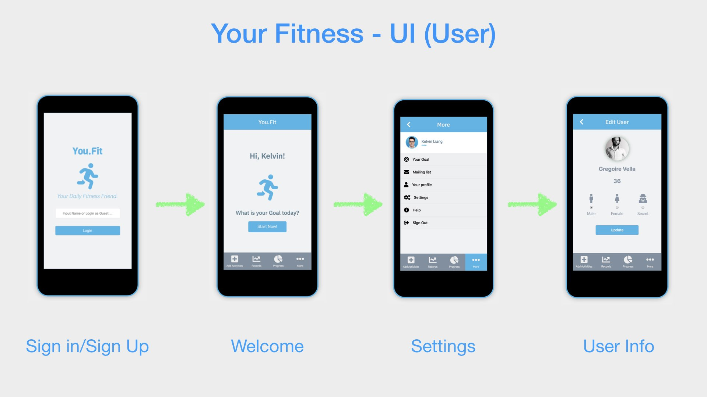
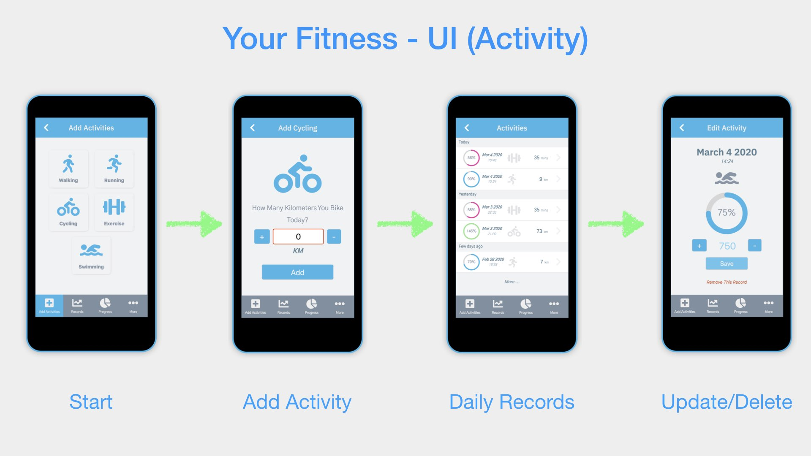
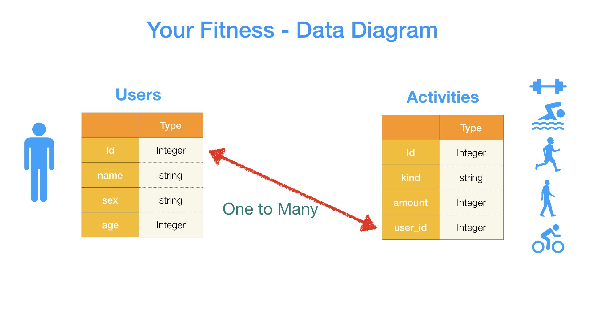
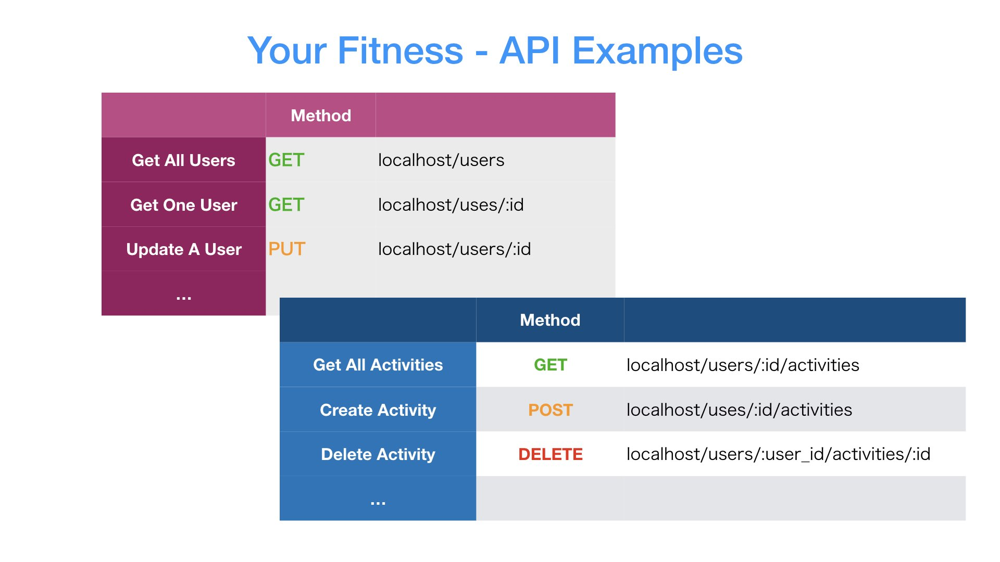

<h1 align="center">🏅 Your Fitness App 🏅</h1>
<p align="center">
  
  <a href="https://github.com/kelvin8773/your-fitness/blob/master/LICENSE" target="_blank">
    
  </a>
  <a href="https://twitter.com/kelvin9877" target="_blank">
    
  </a>

  <a href="https://youfit.netlify.com/" target="_blank">
    
  </a>
</p>

[](https://youfit.netlify.com)
[](https://youfit.netlify.com)
[](https://youfit.netlify.com)
[](https://youfit.netlify.com)
[](https://youfit.netlify.com)

> A Full stack project that include Frontend (React/Redux JS) and Backend (Ruby On Rails).

### ✨ [FrontEnd Demo](https://youfit.netlify.com)

### ✨ [BackEnd Document](https://github.com/kelvin8773/your-fitness-api)

## Project Detail

### Tech Stack
* React (Hook)
* Redux (Redux Tool Kit)

## Project Related Resources
* [Fontawesome](https://fontawesome.com/start)
* [UI Design](https://www.behance.net/gallery/13271423/Bodytrackit-An-iOs-app-Branding-UX-and-UI)

## Install

```sh
yarn install
```

## Usage

```sh
yarn run start
```

## Run tests

```sh
yarn run test
```

## Author

👤 **Kelvin Liang**

* Website: kelvinliang.cn
* Twitter: [@kelvin9877](https://twitter.com/kelvin9877)
* Github: [@kelvin8773](https://github.com/kelvin8773)
* LinkedIn: [@kelvin9877](https://linkedin.com/in/kelvin9877)

## 🤝 Contributing

Contributions, issues and feature requests are welcome!<br />Feel free to check [issues page](https://github.com/kelvin8773/your-fitness/issues). You can also take a look at the [contributing guide](https://github.com/kelvin8773/your-fitness/pulls).

## Show your support

Give a ⭐️ if this project helped you!

## 📝 License

Copyright © 2020 [Kelvin Liang](https://github.com/kelvin8773).<br />
This project is [MIT](https://github.com/kelvin8773/your-fitness/blob/master/LICENSE) licensed.

***
_This README was generated with ❤️ by [readme-md-generator](https://github.com/kefranabg/readme-md-generator)_